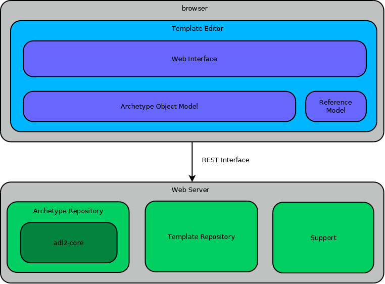

# Adl Designer

ADL 2.0 designer (template designer, archetype editor,...)

## Initial Setup

Prerequisites:

* git client
* Java 1.8 SDK
* Apache Maven 3 - https://maven.apache.org

Clone adl-designer from GitHub:

```bash 
git clone https://github.com/openEHR/adl-designer.git
```    


Application is built as a war archive, but it also requires an external folder that holds the configuration and 
workspace (This folder will be referred to as APPHOME). The application comes with a template for APPHOME folder in
_adl-designer/apphome_. To avoid committing your local configuration and workspace to github repository, do not use
this folder directly. Instead, copy _apphome_ to _apphome-work_, which is excluded in .gitignore: 
 
```bash
cp -r apphome apphome-work
```
 
  
  
Back at _adl-designer_ directory, use Maven to build the project:  
  
```bash
mvn clean install
```
 
This will generate a _designer.war_ file in _designer/target_, which can be deployed into any java web application server.
When deploying the application, you will need to specify _ADL_DESIGNER_APPHOME_ environment variable that points to the 
APPHOME folder. 

For development purposes, you may also run the application with the embedded maven tomcat plugin. This also assumes 
that your APPHOME folder is _adl_designer/apphome-work_, as previously described. 
Go to directory _adl-designer/designer_ and run:

```bash
mvn tomcat7:run
```

This will deploy the application on http://localhost:8080/designer.


### Running designer on a different host or port 

For authenticating on GitHub, a GitHub application configuration is required. Template APPHOME is configured to use a
development application that expects the adl-designer to run at http://localhost:8080/designer. If a different URl
is needed, you will have to create a different GitHub application with a different callback url (Append /app/authorize 
to the root url, development application url is http://localhost:8080/designer/app/authorize). 


In config.properties, you will need to change _github.api.auth.client_id_ and _github.api.auth.secret_ to the new 
application key.
 

## Archetype Editor
Part of the designer module, that is capable editing ADL2 archetypes. Can be accessed on the url _/designer/archetype-editor.html_

**Architecture**


Individual module descriptions:
### Web Interface
The web interface is based on jquery and bootstrap3. Html is generated from templates (templates/\*.hbs) using handlebars. Javascript code resides in _js/archetype-editor/\*_.

### Archetype Object Model
Code for manipulating of Archetype Object Model (AOM). Independent of the web interface. Location: _js/am/\*_. Everything in this module can be accesed though a single global variable: _AOM_.

Some of the supported functionality:

* AOM.ArchetypeModel - Wraps AOM of a single archetype, allowing for easier manipulation. In addition to  functionality such as manipulating terminology, annotations, constraints, translations, bindings, it can also deal with specialized archetypes.
* AOM.NodeId - models a single node id, such as _id1.1.3_.
* AOM.RmPath - models a single rm path, such as _/data[id3]/items[id4]/value_
* AOM.AmQuery - enables searching for cosntraints that match a particular rm path
* AOM.createNewArchetype - Create a new archetype from scratch, with a provided basic structure based on the RM class
* AOM.ReferenceModel - Provides reflection-like functionality for a reference model.

### Reference Model
Contains special handling required for a particular reference model, for example rendering constraint for DV_TEXT. Resides in _js/archetype-editor/module-\*_. Archetype designer currently only supports openEHR reference model, however the code is structured to allow easy addition of new models in the future.

Currently supported reference models:
* module-primitive - support for primitive constraints, such as C_INTEGER and special AOM constrains, such as ARCHETYPE_SLOT.
* module-openehr - support for openEHR reference model

### Archetype Repository
Provides the functionality of an archetype repository, such as listing existing archetypes, load/save archetype. Accessible via REST interface.

### Support
Supporting functionality, such as retrieving supported units.

## Template Editor
Can be accessed on the url _/designer/template-editor.html_.

**Architecture**



Template Editor is built on top of the Archetype Editor. As such, it contains the same functionality (only the Web Interface is mostly rewritten), and has these additions:

### Web Interface
Mostly rewritten for the Template Editor. Javascript code resides in _/js/archetype-editor/template-editor\*_

### Archetype Object Model

* AOM.TemplateModel - Models a single template. Every archetype in the template is included as a specialized ArchetypeModel, so on archetype level it can do everything that Archetype Designer can. Additionaly, it provides functions for adding/removing archetypes from the template.

### Template Repository
Provides functionality of a template repository, such as listing existing templates, load/save template. Accessible via REST interface